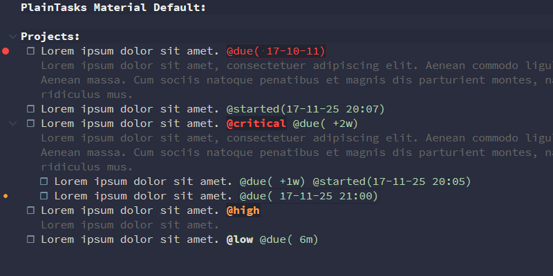
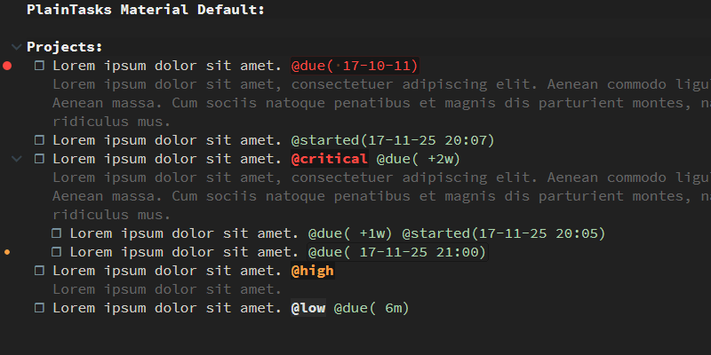
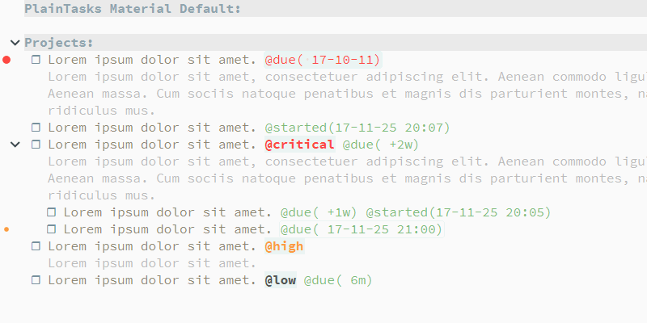

## PlainTasks Material Themes

A collection of [PlainTasks](https://github.com/aziz/PlainTasks) themes for [Sublime Text](https://www.sublimetext.com/) following the aesthetics of the excellent [Material Theme](http://equinsuocha.io/material-theme/).  

GitHub repository <https://github.com/Gregory-K/PlainTasks-Material-Themes>.  

### Screenshots

**Material Default**  


**Material Palenight**  


**Material Darker**  


**Material Lighter**  


### Requirements

* Sublime Text
* Material Theme
* PlainTasks

### Apply

* Copy the `*-tmTheme` files anywhere you like. Suggested location is the Sublime Text Packages directory under the `User` folder. Ctrl+Shift+P (win) Cmd+Shift+P (mac) > `Preferences: Browse Packages`
* Edit your PlainTasks settings `Sublime Text menu > Preferences > Package Settings > PlainTasks > Settings - User`
and enter the path to your preferred theme:
  ```
  {
    "color_scheme": "Packages/User/tasks-material-default.hidden-tmTheme",
    "font_size": 12,
  }
  ```

#### more

Sublime Text [Package Control](https://packagecontrol.io/docs)

### License

These files are under the MIT license. You can find the complete document here: [LICENSE](https://github.com/Gregory-K/PlainTasks-Material-Themes/blob/master/LICENSE).